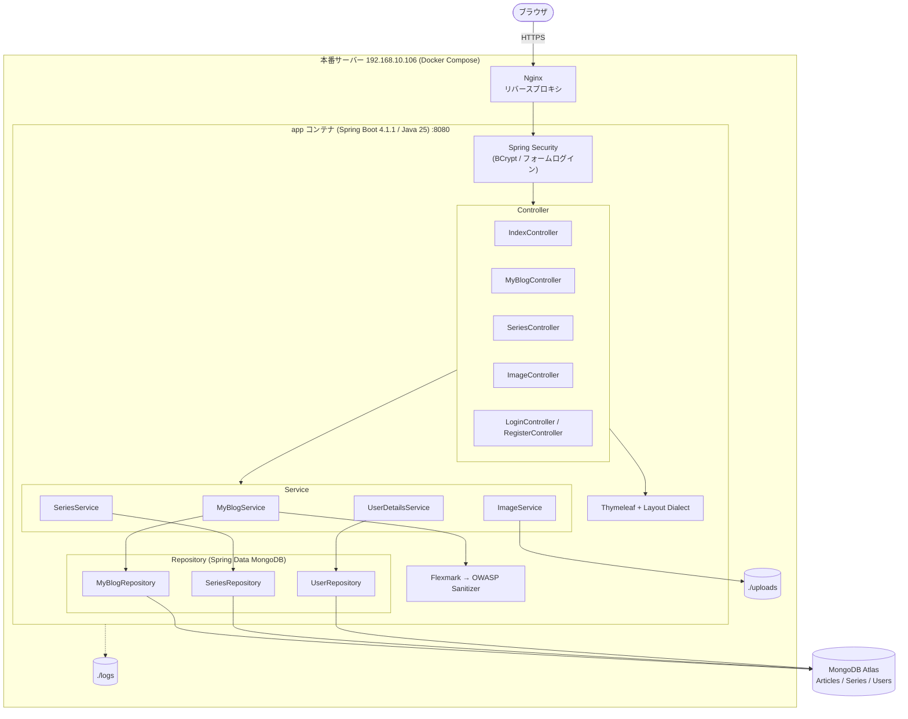
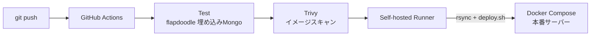

# アーキテクチャ構成図

## システム構成

```mermaid
flowchart TB
    User([ブラウザ])

    subgraph Server["本番サーバー 192.168.10.106 (Docker Compose)"]
        Nginx["Nginx<br/>リバースプロキシ"]

        subgraph App["app コンテナ (Spring Boot 4.1.1 / Java 25) :8080"]
            direction TB
            Security["Spring Security<br/>(BCrypt / フォームログイン)"]

            subgraph Controllers["Controller"]
                C1[IndexController]
                C2[MyBlogController]
                C3[SeriesController]
                C4[ImageController]
                C5[LoginController / RegisterController]
            end

            subgraph Services["Service"]
                S1[MyBlogService]
                S2[SeriesService]
                S3[ImageService]
                S4[UserDetailsService]
            end

            subgraph Repos["Repository (Spring Data MongoDB)"]
                R1[MyBlogRepository]
                R2[SeriesRepository]
                R3[UserRepository]
            end

            View["Thymeleaf + Layout Dialect"]
            MD["Flexmark → OWASP Sanitizer"]
        end

        Logs[("./logs")]
        Uploads[("./uploads")]
    end

    Mongo[("MongoDB Atlas<br/>Articles / Series / Users")]

    User -->|HTTPS| Nginx --> Security --> Controllers
    Controllers --> Services
    Controllers --> View
    S1 --> MD
    S1 --> R1
    S2 --> R2
    S4 --> R3
    S3 --> Uploads
    R1 & R2 & R3 --> Mongo
    App -.-> Logs
```

## CI/CD

```mermaid
flowchart LR
    Dev[git push] --> GA[GitHub Actions]
    GA --> T[Test<br/>flapdoodle 埋め込みMongo]
    T --> Trivy[Trivy<br/>イメージスキャン]
    Trivy --> Runner[Self-hosted Runner]
    Runner -->|rsync + deploy.sh| Compose[Docker Compose<br/>本番サーバー]
```
