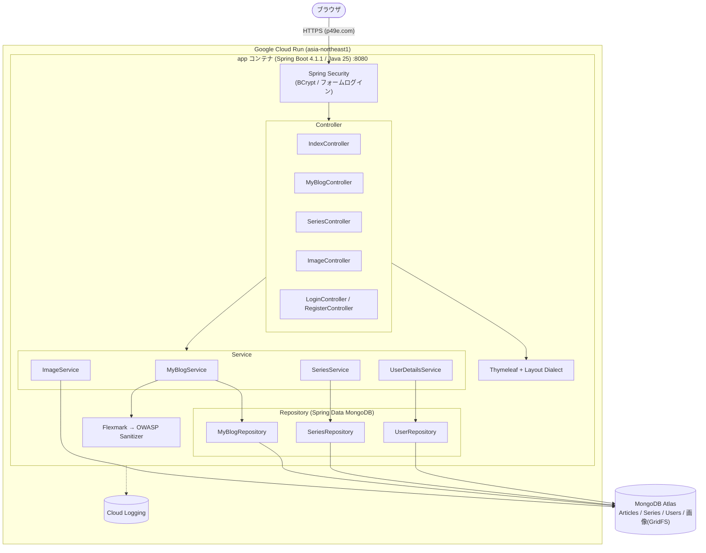
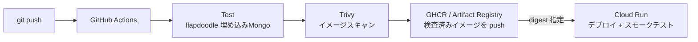

# アーキテクチャ構成図

## システム構成

```mermaid
flowchart TB
    User([ブラウザ])

    subgraph Server["Google Cloud Run (asia-northeast1)"]
        subgraph App["app コンテナ (Spring Boot 4.1.1 / Java 25) :8080"]
            direction TB
            Security["Spring Security<br/>(BCrypt / フォームログイン)"]

            subgraph Controllers["Controller"]
                C1[IndexController]
                C2[MyBlogController]
                C3[SeriesController]
                C4[ImageController]
                C5[LoginController / RegisterController]
            end

            subgraph Services["Service"]
                S1[MyBlogService]
                S2[SeriesService]
                S3[ImageService]
                S4[UserDetailsService]
            end

            subgraph Repos["Repository (Spring Data MongoDB)"]
                R1[MyBlogRepository]
                R2[SeriesRepository]
                R3[UserRepository]
            end

            View["Thymeleaf + Layout Dialect"]
            MD["Flexmark → OWASP Sanitizer"]
        end

        Logs[("Cloud Logging")]
    end

    Mongo[("MongoDB Atlas<br/>Articles / Series / Users / 画像(GridFS)")]

    User -->|"HTTPS (p49e.com)"| Security --> Controllers
    Controllers --> Services
    Controllers --> View
    S1 --> MD
    S1 --> R1
    S2 --> R2
    S4 --> R3
    S3 --> Mongo
    R1 & R2 & R3 --> Mongo
    App -.-> Logs
```

## CI/CD

```mermaid
flowchart LR
    Dev[git push] --> GA[GitHub Actions]
    GA --> T[Test<br/>flapdoodle 埋め込みMongo]
    T --> Trivy[Trivy<br/>イメージスキャン]
    Trivy --> Push[GHCR / Artifact Registry<br/>検査済みイメージを push]
    Push -->|digest 指定| Run[Cloud Run<br/>デプロイ + スモークテスト]
```
